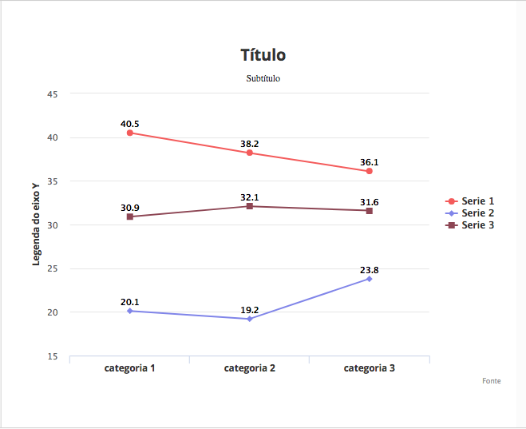

# Chart - Megadraft Plugin
[](https://travis-ci.org/globocom/megadraft-chart-plugin)

## Component

It's a Megadraft Plugin React Component that render charts using data given by user.

Highcarts JS it's a lib dependency used to render charts.
You must have a License to use Highcharts as commercial purpose

> Highcharts is a charting library written in pure JavaScript, offering an easy way of adding interactive charts to your web site or web application. Highcharts currently supports line, spline, area, areaspline, column, bar, pie, scatter, angular gauges, arearange, areasplinerange, columnrange, bubble, box plot, error bars, funnel, waterfall and polar chart types.
[See more](https://www.highcharts.com/products/highcharts)

## Architecture


On select `Chart` plugin at Megadraft plugin modal, a `ModalChart` component will be instantiated.

`ModalChart` is a modal component splitted in two parts: form and preview.
There are three chart type options: line, column and pie. Each one has their own Form component:

1. `FormLine` for line chart;
2. `FormColumn` for column chart;
3. `FormPie` for pie chart;

`Chart` is the component in charge of render a chart preview. Chart Preview is re-render whenever a change on the Form is made.

`HighchartsConnector` is responsible for translating the form data into valid data to Highcharts lib.

To complete chart edition, `APLICAR` button should be clicked.
It's possible to edit a Chart by clicking in Megadraft edit block button.
A SVG copy of the chart is added to block data.


## Line Chart preview Example




## Install dependencies (npm)

```
make setup
```

## Running dev-server

```
make run
open http://localhost:8080/demo
```

## Testing

To run test and lint

```
make test
```

You can also run tests as watch mode:

```
make watch_unit
```
