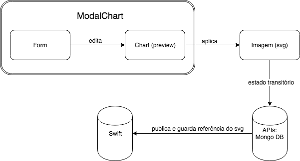

# Gráfico - Megadraft Plugin


## Componente

Gráfico é um componente CMA que desenha gráficos de acordo com os dados
fornecidos pelo usuário.

Utiliza-se da framework do Highcharts para renderizar os gráficos.


## Arquitetura



Ao selecionar no modal do Megadraft o componente `Gráfico`, é instanciado o componente `ModalChart`.

O `ModalChart` é divido em duas partes: formulário e preview.
Existem três opções de geração de gráfico: linha, barra ou pizza. Cada um possui
um componente de formulário diferente:

1. `FormLine` para gráfico de linha;
2. `FormColumn` para gráfico de barra;
3. `FormPie` para gráfico de pizza;

Quanto ao preview, o componente responsável por rederizá-lo é o `Chart`. Durante qualquer edição no formulário, o preview do gráfico é atualizado.

O JavaScript responsável por renderizar o formulário correspondente ao tipo de
gráfico selecionado é o `HighchartsConnector`.

Uma vez finalizada a construção do gráfico, deve-se aplicá-lo clicando no botão `APLICAR`.

Ao aplicar o gráfico, é salvo um SVG **rascunho** do mesmo no MongoDB do API's.
É possível editá-lo ao clicar no botão de edição. Se o houver edição e o gráfico
for aplicado novamente, o rascunho é sobrescrito com as alterações.

Somente após **publicado** o Multicontent, o SVG é salvo no Swift. Além disso,
é guardada no MongoDB do API's uma referência do objeto SVG.


#### Obs:

No path `src/form` encontram-se "Stateless Functions Components". Apenas
auxiliam na estruturação dos markups do componente.


## Exemplo do preview de um gráfico de linha


## Instalando as dependências (npm)

```
make setup
```

## Rodando o dev-server

```
make run
open http://localhost:8080/demo
```

## Testando

Para rodar os testes + eslint

```
make test
```

Se você está constantemente rodando testes, existe uma alternativa mais rápida
utilizando watch:

```
make watch_unit
```
